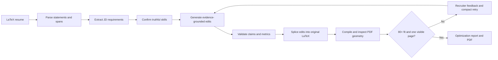

# ApplyTeX ATS

Evidence-grounded, AI-assisted resume tailoring for LaTeX resumes.

ApplyTeX ATS parses a `.tex` resume into addressable statements, compares it
with a job description, asks the user to confirm only defensible skills, and
rewrites selected summary, experience, project, and skills content. It then
splices those edits back into the original source and compiles a submission-ready
one-page PDF.

The system is designed around a deliberately strict rule: improve relevance
without inventing skills, employers, education, certifications, metrics, or
domain experience.

> This is an engineering and evaluation MVP. Its fit score is a transparent
> quality proxy, not a promise of ATS behavior, interviews, or hiring outcomes.

## Why This Project Is Different

- **LaTeX-native editing:** preserves the original template instead of rebuilding
  the resume from generic HTML or JSON.
- **Statement-level provenance:** every editable bullet has a stable ID and exact
  character span in the original source.
- **Evidence-aware optimization:** confirmed skills and supported equivalents can
  improve JD alignment; unsupported hard claims are rejected.
- **Strict one-page enforcement:** checks both PDF page count and text geometry,
  catching content clipped below the page boundary.
- **Recruiter review loop:** a bounded reviewer pass critiques relevance and
  readability before the result is accepted.
- **Multi-model routing:** supports Groq, Anthropic, Ollama, and Codex SDK routes
  for different pipeline stages.
- **Benchmark-first development:** includes synthetic evidence ledgers,
  adversarial JDs, holdout cases, failure tracking, and blind-review tooling.
- **Public job discovery:** normalizes Greenhouse, Lever, and Ashby boards into
  one typed job model.
- **Human-approved application state:** submission cannot begin until an
  application reaches an explicit approved state.

## Current MVP

Implemented:

- Brace-aware LaTeX parsing and editable/locked section classification
- Byte-preserving reconstruction by descending character-span replacement
- Deterministic ATS fit and five-category match analysis
- Skill confirmation and evidence-supported keyword equivalence
- Anti-fabrication checks for tools, domains, metrics, education, and employers
- Compact rewrite retries and automatic one-page overflow repair
- Next.js web UI with profile setup, guided 3-step tailor, jobs, applications, and Resume Lab
- FastAPI upload, optimize, analyze, refine, tailor sessions, and profile endpoints
- Local JSONL analytics and optional LangSmith tracing
- Reproducible benchmark CLI for synthetic resumes and public-job metadata
- Public job search API with local SQLite job and application persistence
- Chrome extension for 13 providers, including LinkedIn, Greenhouse, Lever,
  Ashby, Workday, iCIMS, and SmartRecruiters, with job capture, resume upload,
  form scanning, and reviewed field filling

Current limitations:

- Tailor sessions now persist in SQLite; classic `/latex/*` optimize sessions are
  still in memory and disappear when the API restarts.
- The Chrome extension fills reviewed known fields but never submits forms.
- Authentication is optional and off by default (`APPLYTEX_REQUIRE_AUTH=0`). See
  [`docs/AUTH.md`](docs/AUTH.md). Profile scoping via `X-Profile-Id` works without
  passwords for local multi-profile use.
- PDF rendering requires a local LaTeX engine for authoritative page checks.
- Direct OpenAI and Gemini backends are placeholders; Codex SDK is supported
  separately through local Codex authentication.
- Fit scores are not calibrated to any single commercial ATS vendor.

See [`docs/JOBRIGHT_AND_ATS_AUDIT.md`](docs/JOBRIGHT_AND_ATS_AUDIT.md) for the
Jobright comparison, provider workflow matrix, live-verification status, and
cross-provider browser QA results.

## Quick Start

Requirements:

- Python 3.12 or 3.13
- [`uv`](https://docs.astral.sh/uv/)
- `pdflatex` for PDF rendering, recommended but optional

```bash
uv sync --locked
uv run pytest
```

Launch the web UI (recommended):

```bash
# Terminal 1 — API
uv run applytex-api

# Terminal 2 — frontend
cd frontend && npm install && npm run dev
```

Open [http://localhost:3000](http://localhost:3000). Sign in with a local username, complete your profile, and tailor resumes against saved or captured jobs.

The legacy Streamlit UI remains available for one release cycle:

```bash
uv run streamlit run src/latex_resume/streamlit_app.py --server.port 8501
```

Open [http://localhost:8501](http://localhost:8501). The public repository ships
with a synthetic resume and paraphrased job-description fixture, so the UI works
without private data or API keys. Deterministic analysis remains available when
an LLM provider is not configured.

Run the core parser and renderer:

```bash
uv run python -m latex_resume.engine samples/sample_resume.tex
```

Run the local API:

```bash
uv run applytex-api
# API docs: http://localhost:8000/docs
```

## Model Configuration

Copy `.env.example` to `.env` and configure only the provider you intend to use.
The `.env` file is ignored by Git.

| Backend | Authentication | Typical use |
|---|---|---|
| `groq` | `GROQ_API_KEY` | Fast hosted structured generation |
| `anthropic` | `ANTHROPIC_API_KEY` | Hosted reasoning and rewriting |
| `ollama` | Local Ollama server | Private local experiments |
| `codex` | Codex CLI/app sign-in | Codex SDK optimization route |
| `openai` | `OPENAI_API_KEY` | Application-answer fallback with official web research |

For Codex:

```bash
codex
```

Sign in once, then configure:

```dotenv
LLM_BACKEND=codex
CODEX_MODEL=gpt-5.5
CODEX_SANDBOX=read_only
LLM_BACKEND_APPLICATION=codex
CODEX_MODEL_APPLICATION=gpt-5.4-mini
```

Open-ended application answers use a review-first draft flow. They are capped at
100 words, grounded in the saved resume/profile and captured job description,
and use official company sources. Application drafts use the faster Codex mini
route and cache official research for repeated questions on the same captured
job. Codex authentication is tried first; the OpenAI Responses API is used only
when an API key is configured and Codex fails.

Use `gpt-5.4-mini` for faster lightweight Codex tasks. See
[Model routing](docs/MODEL_ROUTING.md) for the recommended local M4/16 GB route.

## Job Discovery API

The first application-automation phase searches public employer boards without
browser scraping:

```bash
uv run applytex-api
```

```bash
curl -X POST http://localhost:8000/jobs/search \
  -H 'Content-Type: application/json' \
  -d '{
    "query": {"text": "machine learning engineer", "remote_only": true},
    "sources": [
      {"provider": "greenhouse", "board_token": "company-token", "company": "Company"}
    ]
  }'
```

Searches and application states are stored in `.applytex/applytex.db` by
default. Browser filling remains blocked until the
reviewed fill executor is implemented.

The Chrome extension lives in [`extension/`](extension/). Load it as an unpacked
extension after starting the API. It captures jobs, scans application forms,
and fills only after a separate user click. Final submission remains manual.

## Pipeline



Locked sections such as education, certifications, publications, and personal
information never enter the editable statement index. See
[docs/ARCHITECTURE.md](docs/ARCHITECTURE.md) for data flow and invariants.

## Benchmark

The benchmark corpus contains:

- 40 synthetic LaTeX resumes with immutable evidence ledgers
- 40 taxonomy-informed JDs and 20 adversarial JDs committed as fixtures
- metadata for 60 live public job postings, with full text retained locally
- 4,800 deterministic resume/JD pair scores
- 120 stratified optimization cases with a fixed holdout split

```bash
uv run applytex-benchmark build-resumes
uv run applytex-benchmark fetch-jds
uv run applytex-benchmark score
uv run applytex-benchmark select-cases
uv run applytex-benchmark optimize --providers deterministic --include-holdout
uv run applytex-benchmark report
```

Full provider runs can use `groq,codex`. Generated results, live JD snapshots,
and private review artifacts are excluded from Git. Read
[benchmark_data/README.md](benchmark_data/README.md) before refreshing data.

## Observability

Set the following values to send PII-light stage traces to LangSmith:

```dotenv
SMARTJOBAPPLY_LANGSMITH_TRACE=true
LANGSMITH_API_KEY=your_langsmith_api_key
LANGSMITH_PROJECT=applytex-local
```

Traces include routes, latency, fit deltas, accepted/rejected change counts,
render status, and warnings. Full resume text is not included in trace metadata
by default.

## Repository Structure

```text
frontend/                Next.js web UI (primary)
src/latex_resume/
  parser.py              LaTeX section and statement-span extraction
  reconstructor.py       Byte-preserving statement replacement
  renderer.py            PDF compilation and visual one-page enforcement
  ats.py                 Submission-fit scoring
  screening.py           Recruiter-style category analysis
  optimizer.py           Optimization and reviewer orchestration
  change_validation.py   Truthfulness and claim-drift gates
  llm.py                 Provider adapters and usage tracking
  streamlit_app.py       Legacy Streamlit UI (deprecated)
  api.py                 FastAPI development interface
  job_models.py          Job, profile, form, and workflow contracts
  job_sources.py         Public ATS job-board adapters
  application_store.py   SQLite job and application persistence
  benchmark/             Corpus, runner, audit, review, and reporting tools
```

## Safety And Data Handling

- Never commit `.env`, private resumes, generated PDFs, or full live JD snapshots.
- Review every generated resume before using it.
- Confirm only skills that you can defend in an interview.
- Treat the score as decision support, not as a hiring prediction.
- Report vulnerabilities privately using [SECURITY.md](SECURITY.md).

## Development

```bash
uv sync --locked
uv run pytest
uv build
```

Contributions should preserve the parser, reconstruction, truthfulness, and
one-page invariants documented in [CONTRIBUTING.md](CONTRIBUTING.md).

## Documentation

- [Architecture](docs/ARCHITECTURE.md)
- [Job automation architecture](docs/JOB_AUTOMATION_ARCHITECTURE.md)
- [Model routing](docs/MODEL_ROUTING.md)
- [ATS and AI screening research](docs/ats_ai_screening_research.md)
- [Benchmark methodology](benchmark_data/README.md)
- [Product roadmap](SMARTJOBAPPLY_PLAN.md)
- [Release checklist](docs/RELEASE_CHECKLIST.md)
- [Portfolio and interview guide](docs/PORTFOLIO.md)

## License

Licensed under the [Apache License 2.0](LICENSE).
