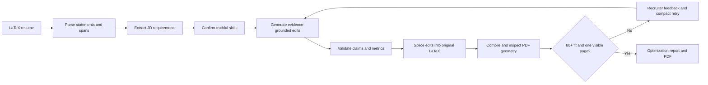

# ApplyTeX ATS

Evidence-grounded, AI-assisted resume tailoring for LaTeX resumes.

ApplyTeX ATS parses a `.tex` resume into addressable statements, compares it
with a job description, asks the user to confirm only defensible skills, and
rewrites selected summary, experience, project, and skills content. It then
splices those edits back into the original source and compiles a submission-ready
one-page PDF.

The system is designed around a deliberately strict rule: improve relevance
without inventing skills, employers, education, certifications, metrics, or
domain experience.

> This is an engineering and evaluation MVP. Its fit score is a transparent
> quality proxy, not a promise of ATS behavior, interviews, or hiring outcomes.

## Why This Project Is Different

- **LaTeX-native editing:** preserves the original template instead of rebuilding
  the resume from generic HTML or JSON.
- **Statement-level provenance:** every editable bullet has a stable ID and exact
  character span in the original source.
- **Evidence-aware optimization:** confirmed skills and supported equivalents can
  improve JD alignment; unsupported hard claims are rejected.
- **Strict one-page enforcement:** checks both PDF page count and text geometry,
  catching content clipped below the page boundary.
- **Recruiter review loop:** a bounded reviewer pass critiques relevance and
  readability before the result is accepted.
- **Multi-model routing:** supports Groq, Anthropic, Ollama, and Codex SDK routes
  for different pipeline stages.
- **Benchmark-first development:** includes synthetic evidence ledgers,
  adversarial JDs, holdout cases, failure tracking, and blind-review tooling.
- **Public job discovery:** normalizes Greenhouse, Lever, and Ashby boards into
  one typed job model.
- **Human-approved application state:** submission cannot begin until an
  application reaches an explicit approved state.

## Current MVP

Implemented:

- Brace-aware LaTeX parsing and editable/locked section classification
- Byte-preserving reconstruction by descending character-span replacement
- Deterministic ATS fit and five-category match analysis
- Skill confirmation and evidence-supported keyword equivalence
- Anti-fabrication checks for tools, domains, metrics, education, and employers
- Compact rewrite retries and automatic one-page overflow repair
- Next.js web UI with profile setup, guided 3-step tailor, jobs, applications, and Resume Lab
- FastAPI upload, optimize, analyze, refine, tailor sessions, and profile endpoints
- Local JSONL analytics and optional LangSmith tracing
- Reproducible benchmark CLI for synthetic resumes and public-job metadata
- Public job search API with local SQLite job and application persistence
- Chrome extension for 13 providers, including LinkedIn, Greenhouse, Lever,
  Ashby, Workday, iCIMS, and SmartRecruiters, with job capture, resume upload,
  form scanning, and reviewed field filling

Current limitations:

- Tailor sessions now persist in SQLite; classic `/latex/*` optimize sessions are
  still in memory and disappear when the API restarts.
- The Chrome extension fills reviewed known fields but never submits forms.
- Authentication is optional and off by default (`APPLYTEX_REQUIRE_AUTH=0`). See
  [`docs/AUTH.md`](docs/AUTH.md). Profile scoping via `X-Profile-Id` works without
  passwords for local multi-profile use.
- PDF rendering requires a local LaTeX engine for authoritative page checks.
- Direct OpenAI and Gemini backends are placeholders; Codex SDK is supported
  separately through local Codex authentication.
- Fit scores are not calibrated to any single commercial ATS vendor.

See [`docs/JOBRIGHT_PARITY_PLAN.md`](docs/JOBRIGHT_PARITY_PLAN.md) for the
September 2026 live comparison, current feature inventory, and implementation priorities.
The July [ATS audit](docs/JOBRIGHT_AND_ATS_AUDIT.md) is historical evidence.

The [autofill strategy and evaluation plan](docs/AUTOFILL_STRATEGY_AND_EVALUATION.md)
explains saved facts, question/option matching, platform adapters and the synthetic
application lab. The [ML portfolio roadmap](docs/ML_PORTFOLIO_ROADMAP.md) proposes
grounded retrieval, held-out evaluation, model comparisons and evidence tracking.

### Try the synthetic application lab

```bash
uv run python scripts/autofill_lab.py
# Open http://127.0.0.1:8765/lab
# In another terminal, with frontend Playwright dependencies installed:
node scripts/autofill_lab_qa.mjs
```

The 39 scenarios use fictional data, the real API and extension panel scripts,
with a local message bridge. They test selected answers, missing facts, separate
documents, repeated fills and multi-step forms. This is synthetic integration
coverage, not proof of every employer form or installed-extension behavior.

## Quick Start

**Requirements:** Python 3.12+, [`uv`](https://docs.astral.sh/uv/), Node 18+ for the UI. `pdflatex` for PDF rendering (optional but recommended).

### 1. Clone and install

```bash
git clone https://github.com/ashrith01/applytex.git
cd applytex
uv sync --locked          # installs all Python deps
uv run pytest
```

### 2. Configure an LLM backend

Copy `.env.example` to `.env` and fill in **one** backend:

```dotenv
# Option A — free Groq tier (fastest to start)
LLM_BACKEND=groq
GROQ_API_KEY=gsk_...

# Option B — Anthropic
LLM_BACKEND=anthropic
ANTHROPIC_API_KEY=sk-ant-...

# Option C — local Ollama (no API key required)
LLM_BACKEND=ollama
OLLAMA_BASE_URL=http://localhost:11434
OLLAMA_MODEL=qwen3:8b
```

### 3. Start the API and web UI

```bash
# Terminal 1 — FastAPI backend
uv run applytex-api
# → http://localhost:8000  (interactive docs at /docs)

# Terminal 2 — Next.js frontend
cd frontend && npm install && npm run dev
# → http://localhost:3000
```

Open [http://localhost:3000](http://localhost:3000). Sign in with a local username, complete your profile, and tailor resumes against saved or captured jobs.

### 4. Smoke-test the API directly

```bash
# Upload a résumé
curl -s -F "file=@samples/sample_resume.tex" http://localhost:8000/latex/upload | jq .session_id

# Optimize against a JD  (replace <session_id>)
curl -s -X POST http://localhost:8000/latex/optimize \
  -H 'Content-Type: application/json' \
  -d '{"session_id":"<session_id>","job_description":"We need a Python backend engineer with FastAPI experience."}' \
  | jq '{overflow, page_count, ats_target_met}'
```

### Optional extras

```bash
# Streamlit legacy UI
pip install "applytex[ui]"
uv run streamlit run src/latex_resume/streamlit_app.py --server.port 8501

# Parser smoke test (no LLM, no pdflatex required)
uv run python -m latex_resume.engine samples/sample_resume.tex
```

## Environment Variables

| Variable | Default | Purpose |
|---|---|---|
| `LLM_BACKEND` | `ollama` | Active LLM provider: `groq` \| `anthropic` \| `ollama` \| `codex` \| `openai` |
| `GROQ_API_KEY` | — | Required when `LLM_BACKEND=groq` |
| `ANTHROPIC_API_KEY` | — | Required when `LLM_BACKEND=anthropic` |
| `OLLAMA_BASE_URL` | `http://localhost:11434` | Ollama server address |
| `OLLAMA_MODEL` | `qwen3:4b` | Default Ollama model |
| `APPLYTEX_DB_PATH` | `.applytex/applytex.db` | SQLite database path (must be writable at startup) |
| `APPLYTEX_REQUIRE_AUTH` | `0` | Set to `1` to require bearer-token auth on all API routes |
| `APPLYTEX_LOG_FORMAT` | `console` | Log format: `console` (coloured key=value) or `json` (for log pipelines) |
| `LOG_LEVEL` | `info` | Log level: `debug` \| `info` \| `warning` \| `error` |
| `HOST` | `127.0.0.1` | API bind address |
| `PORT` | `8000` | API bind port |
| `SMARTJOBAPPLY_LANGSMITH_TRACE` | `false` | Send pipeline traces to LangSmith |
| `LANGSMITH_API_KEY` | — | Required when tracing is on |

See `.env.example` for the full list including per-task model routing variables.

## Model Configuration

Copy `.env.example` to `.env` and configure only the provider you intend to use.
The `.env` file is ignored by Git.

| Backend | Authentication | Typical use |
|---|---|---|
| `groq` | `GROQ_API_KEY` | Fast hosted structured generation |
| `anthropic` | `ANTHROPIC_API_KEY` | Hosted reasoning and rewriting |
| `ollama` | Local Ollama server | Private local experiments |
| `codex` | Codex CLI/app sign-in | Codex SDK optimization route |
| `openai` | `OPENAI_API_KEY` | Application-answer fallback with official web research |

For Codex:

```bash
codex
```

Sign in once, then configure:

```dotenv
LLM_BACKEND=codex
CODEX_MODEL=gpt-5.5
CODEX_SANDBOX=read_only
LLM_BACKEND_APPLICATION=codex
CODEX_MODEL_APPLICATION=gpt-5.4-mini
```

Open-ended application answers use a review-first draft flow. They are capped at
100 words, grounded in the saved resume/profile and captured job description,
and use official company sources. Application drafts use the faster Codex mini
route and cache official research for repeated questions on the same captured
job. Codex authentication is tried first; the OpenAI Responses API is used only
when an API key is configured and Codex fails.

Use `gpt-5.4-mini` for faster lightweight Codex tasks. See
[Model routing](docs/MODEL_ROUTING.md) for the recommended local M4/16 GB route.

## Job Discovery API

The first application-automation phase searches public employer boards without
browser scraping:

```bash
uv run applytex-api
```

```bash
curl -X POST http://localhost:8000/jobs/search \
  -H 'Content-Type: application/json' \
  -d '{
    "query": {"text": "machine learning engineer", "remote_only": true},
    "sources": [
      {"provider": "greenhouse", "board_token": "company-token", "company": "Company"}
    ]
  }'
```

Searches and application states are stored in `.applytex/applytex.db` by
default. Browser filling remains blocked until the
reviewed fill executor is implemented.

The Chrome extension lives in [`extension/`](extension/). Load it as an unpacked
extension after starting the API. It captures jobs, scans application forms,
and fills only after a separate user click. Final submission remains manual.

## Key API Endpoints

Full interactive docs at `http://localhost:8000/docs` when the API is running.

| Method | Route | Description |
|--------|-------|-------------|
| `GET` | `/health` | Liveness check |
| `POST` | `/latex/upload` | Upload `.tex` file, returns `session_id` |
| `POST` | `/latex/optimize` | Run LLM pipeline against a JD (10 req/min) |
| `POST` | `/latex/{id}/rerender` | Apply manual edits and recompile |
| `GET` | `/latex/{id}/status` | Poll session state |
| `DELETE` | `/latex/{id}` | Delete session (204) |
| `POST` | `/latex/analyze` | Score resume vs JD without rewriting |
| `GET` | `/profile` | Get active candidate profile |
| `PATCH` | `/profile` | Update profile fields |
| `POST` | `/profile/resume` | Upload LaTeX or PDF resume to profile |
| `GET` | `/profiles` | List all local profiles |
| `POST` | `/tailor/sessions` | Start a guided tailor session |
| `POST` | `/tailor/sessions/{id}/optimize` | Run LLM tailor (10 req/min) |
| `POST` | `/tailor/sessions/{id}/refine` | Refine with a plain-English instruction |
| `POST` | `/tailor/sessions/{id}/approve` | Approve and persist the tailored PDF |
| `POST` | `/jobs/search` | Search Greenhouse, Lever, or Ashby boards |
| `GET` | `/jobs` | List captured jobs |
| `POST` | `/applications` | Create an application record |
| `GET` | `/applications` | List applications with filter/sort |
| `POST` | `/extension/jobs/capture` | Browser extension job capture |
| `POST` | `/extension/forms/scan` | Scan a job-application form |
| `GET` | `/extension/forms/{id}/plan` | Generate a fill plan for a scanned form |
| `POST` | `/auth/login` | Exchange profile ID + password for a bearer token |

LLM routes are rate-limited to 10 requests per minute per client IP. All other routes share a 200/minute global limit.

## Pipeline


```mermaid
flowchart LR
    A["LaTeX resume"] --> B["Parse statements and spans"]
    B --> C["Extract JD requirements"]
    C --> D["Confirm truthful skills"]
    D --> E["Generate evidence-grounded edits"]
    E --> F["Validate claims and metrics"]
    F --> G["Splice edits into original LaTeX"]
    G --> H["Compile and inspect PDF geometry"]
    H --> I{"80+ fit and one visible page?"}
    I -- "No" --> J["Recruiter feedback and compact retry"]
    J --> E
    I -- "Yes" --> K["Optimization report and PDF"]
```

Locked sections such as education, certifications, publications, and personal
information never enter the editable statement index. See
[docs/ARCHITECTURE.md](docs/ARCHITECTURE.md) for data flow and invariants.

## Benchmark

The benchmark corpus contains:

- 40 synthetic LaTeX resumes with immutable evidence ledgers
- 40 taxonomy-informed JDs and 20 adversarial JDs committed as fixtures
- metadata for 60 live public job postings, with full text retained locally
- 4,800 deterministic resume/JD pair scores
- 120 stratified optimization cases with a fixed holdout split

```bash
uv run applytex-benchmark build-resumes
uv run applytex-benchmark fetch-jds
uv run applytex-benchmark score
uv run applytex-benchmark select-cases
uv run applytex-benchmark optimize --providers deterministic --include-holdout
uv run applytex-benchmark report
```

Full provider runs can use `groq,codex`. Generated results, live JD snapshots,
and private review artifacts are excluded from Git. Read
[benchmark_data/README.md](benchmark_data/README.md) before refreshing data.

## Observability

Set the following values to send PII-light stage traces to LangSmith:

```dotenv
SMARTJOBAPPLY_LANGSMITH_TRACE=true
LANGSMITH_API_KEY=your_langsmith_api_key
LANGSMITH_PROJECT=applytex-local
```

Traces include routes, latency, fit deltas, accepted/rejected change counts,
render status, and warnings. Full resume text is not included in trace metadata
by default.

## Repository Structure

```text
frontend/                    Next.js 15 web UI (primary)
  src/app/tailor/            5-step guided tailor flow with PDF.js preview,
                             SyncTeX hover-highlight, and layout controls
extension/                   Chrome extension (MV3) for 13 ATS providers
src/latex_resume/
  parser.py                  LaTeX section and statement-span extraction
  reconstructor.py           Byte-preserving statement replacement
  renderer.py                PDF compilation and visual one-page enforcement
  ats.py                     Submission-fit scoring
  screening.py               Recruiter-style category analysis
  optimizer.py               Optimization and reviewer orchestration
  change_validation.py       Truthfulness and claim-drift gates
  llm.py                     Provider adapters, retry logic, usage tracking
  logging_config.py          Structured logging (structlog, JSON or console)
  local_auth.py              Optional bearer-token auth (scrypt password KDF)
  api.py                     FastAPI app factory + shared models/helpers
  routers/                   Route modules (latex, profiles, applications,
                             jobs, extension, tailor, auth)
  job_models.py              Job, profile, form, and workflow contracts
  job_sources.py             Public ATS job-board adapters
  application_store.py       SQLite job and application persistence
  benchmark/                 Corpus, runner, audit, review, and reporting tools
tests/                       316 tests — no LLM calls required
```

## Safety And Data Handling

- Never commit `.env`, private resumes, generated PDFs, or full live JD snapshots.
- Review every generated resume before using it.
- Confirm only skills that you can defend in an interview.
- Treat the score as decision support, not as a hiring prediction.
- Report vulnerabilities privately using [SECURITY.md](SECURITY.md).

## Development

```bash
uv sync --locked
uv run pytest
uv build
```

Contributions should preserve the parser, reconstruction, truthfulness, and
one-page invariants documented in [CONTRIBUTING.md](CONTRIBUTING.md).

## Documentation

- [Architecture](docs/ARCHITECTURE.md)
- [Job automation architecture](docs/JOB_AUTOMATION_ARCHITECTURE.md)
- [Model routing](docs/MODEL_ROUTING.md)
- [ATS and AI screening research](docs/ats_ai_screening_research.md)
- [Benchmark methodology](benchmark_data/README.md)
- [Product roadmap](SMARTJOBAPPLY_PLAN.md)
- [Release checklist](docs/RELEASE_CHECKLIST.md)
- [Portfolio and interview guide](docs/PORTFOLIO.md)

## License

Licensed under the [Apache License 2.0](LICENSE).
