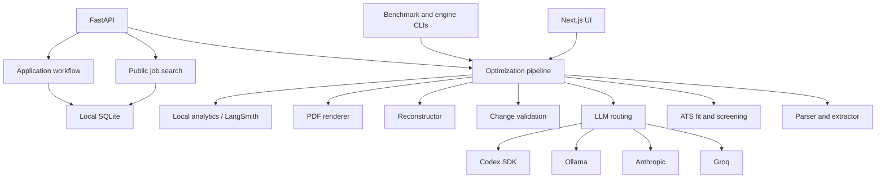

# Architecture

ApplyTeX ATS is a local-first LaTeX resume optimization MVP. Its core design
goal is to improve job-description relevance while preserving source formatting
and preventing unsupported claims.

## Components

## Six-Stage Core

1. **Parse:** scan LaTeX sections and assign stable statement IDs with exact
   character spans.
2. **Classify:** allow edits only in summary, work experience, projects, and
   skills.
3. **Optimize:** extract JD requirements, build a skill plan, and generate
   evidence-grounded statement replacements.
4. **Validate and reconstruct:** reject unsupported claims, then apply accepted
   edits in descending span order.
5. **Render:** compile with `pdflatex`, count pages, and inspect the lowest text
   baseline.
6. **Enforce:** compact or prune lower-value editable content until the result is
   one visible page, or block it from submission-ready status.

## Core Invariants

### Byte-Preserving Reconstruction

Statement spans include editable text only. Replacements never include the
surrounding `\item`, custom command, whitespace, or template structure. A no-op
reconstruction must be byte-identical to the input.

### Locked Facts

Education, certifications, publications, personal information, and unknown
sections are excluded from the editable statement index. Validation also
rejects edits against locked IDs defensively.

### Evidence Before Keywords

The optimizer may use adjacent wording only when the resume contains supporting
evidence. For example, FastAPI and Postman can support “API development.”
Unconfirmed hard tools, employers, credentials, degrees, metrics, and industry
experience cannot be introduced.

### One Visible Page

Page count alone is insufficient because LaTeX can place text below the PDF
media box while still reporting one page. The renderer therefore requires:

- exactly one PDF page;
- no text baseline below the configured bottom safety margin;
- a successful compile before exposing the optimized PDF.

## Scoring

The visible Submission Fit Score combines supportable skills, contextual JD
language, experience relevance, domain fit, and education alignment. Missing
unconfirmed hard tools are reported separately rather than encouraging fake
claims. The raw score remains available for diagnostics.

This score is a project-defined quality proxy. It is not a reverse-engineered
score from a commercial ATS.

## Runtime And Persistence

Resume optimization sessions remain in process memory. Public job searches and
application workflow states are persisted in local SQLite. Optimization runs can
additionally write local JSONL analytics, and LangSmith tracing is optional.
Persistent user accounts and durable resume-version records remain future work.

The application state machine requires an explicit `approved` state before
`submitting`. Browser form scanning and submission are not part of the current
phase.

## Trust Boundaries

- Uploaded LaTeX is untrusted input.
- LLM output is untrusted until schema and claim validation pass.
- Provider calls may transmit resume/JD content according to provider terms.
- Local runs should not expose the development API to an untrusted network.
- Generated resumes require human review before use.
- Future browser automation must stop at review until the user approves the
  exact job, resume, answers, and submission.
