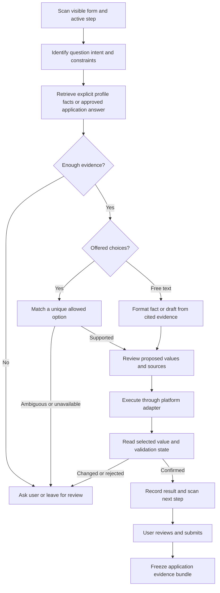

# Autofill strategy, platform coverage, and evaluation

Updated September 10, 2026. See [Jobright parity inventory](JOBRIGHT_PARITY_PLAN.md)
for the broader product comparison and pending Git work.

## Product decision

Use both the user's facts and the actual question/options. A saved answer alone
does not establish what a question means; an offered option does not establish
that the user qualifies for it. The workflow should be:



The first implementation is deterministic. Existing narrative drafting is a
separate, reviewable workflow. A future model can interpret unfamiliar wording
and rank candidate answers, but its output must reference supplied facts and
allowed option IDs. It must be able to return `needs_review`. A model must not
invent experience, eligibility, compensation, consent, or identity answers.

Examples using the lab's fictional profile:

| Question/options | Evidence | Correct behavior |
|---|---|---|
| Current sponsorship: Yes / No | Current sponsorship = false | No |
| Future sponsorship: No / Yes | Future sponsorship = true | Yes |
| Relocation: Prefer not to answer / No / Yes | Willing to relocate = false | No, regardless of option order |
| Language: JavaScript / Java | Saved preferred language = Java | Java |
| Language: JavaScript / TypeScript | Saved preferred language = Java | Leave unanswered |
| Authorized: Yes with restrictions / Yes without restrictions / No | Authorized = true, restrictions unknown | Ask which qualification applies |
| Years of Rust experience | Rust duration absent | Ask; do not derive a number from a skill mention |
| Gender | Saved value exists, autofill consent off | Leave unanswered |
| Required cover-letter attachment | Resume PDF exists | Request the cover letter; do not attach the resume |
| Name already entered on page | Profile differs | Keep the page answer unless replacement is explicitly selected |

## What was implemented in this increment

- `option_matching.py`: unique exact matches and explicit aliases; no generic
  substring selection. Duplicate/ambiguous or unavailable labels abstain.
- `form_resolution.py`: validates selections against offered options, including
  multi-select completeness; handles month names and scoped veteran wording.
- `api.py`, `job_models.py`, extension router: preserve existing values by
  default; `replace_existing` explicitly requests a replacement plan. Validate
  one-off overrides against offered choices, and reject text as a file upload.
- `panel.js`: exact-first unique selection for native and ordinary custom
  dropdowns, corrected native-select placeholder detection, prompt extraction
  without option text, separate cover-letter attachment, later-step detection,
  and a replacement checkbox that resets after filling or a form change.
- `scripts/autofill_lab.py`: local synthetic applications with the actual panel
  scripts and real API using an isolated fictional profile/database.
- `scripts/autofill_lab_qa.mjs`: automated answer-level assertions against the
  lab; `tests/test_option_matching.py`: option permutations and API regressions.

This is an increment toward parity. It does not reproduce Jobright's private
implementation or establish universal platform coverage.

## Data to maintain

The existing `CandidateProfile` and SQLite store already support contact/address
data, multiple education/work records, skills/projects, resume sources/files,
custom answers, tri-state eligibility facts, compensation preferences, company
relationships, and voluntary demographic preferences. Extension profile editing
is present in the local uncommitted work.

| Data group | Required semantics | Next improvement |
|---|---|---|
| Identity/contact | Names, optional preferred name, international phone components, address, links | Locale-aware formatting and validation; preserve diacritics |
| Education/work | Separate records, stable IDs, dates, current flags, degree/major/GPA scale | Record-level evidence and date precision; never substitute record 0 for a missing record |
| Skills/projects | User-approved skill, source claim, demonstrated dates and context | Evidence retrieval with claim IDs; compute duration only from confirmed non-overlapping intervals |
| Eligibility | Unknown/true/false; current and future sponsorship separate; country-specific authorization | Country/jurisdiction scope and qualification details; no legal inference from education/location |
| Preferences | Location, relocation/travel, start date, salary amount/currency/period | Scope by application, employment type and effective date |
| Company relationships | Per-company current/prior employment, affiliations | Normalize company identity without transferring an answer between unrelated employers |
| Reusable answers | Prompt intent, answer, source, applicability and last confirmation | Replace unconstrained fuzzy prompt reuse with typed answer intents and scope |
| Documents | Exact bytes, hash, filename, MIME type, version and approval | Resume/cover-letter library with application-specific selection |
| Sensitive/consent | Explicit opt-in, restricted access, separate consent intents | Field-level access controls, retention/export/deletion and redacted diagnostics |

Proposed fact metadata: `fact_id`, `profile_version`, `value`, `unit`, `scope`,
`source_kind`, `source_ref`, `confirmed_at`, `valid_from`, `valid_until` and
`sensitivity`. These fields are a design proposal, not an existing complete schema.
Unknown must remain distinct from false, zero, blank, and “prefer not to answer.”

When the user corrects a form, offer **use once** or **propose profile update**.
Show the old/new value and scope before saving a reusable change. A correction on
one employer's application must not silently rewrite the general profile.
Employer credentials must never enter the profile, logs, dataset, or evidence bundle.

## Platform strategy

Maintain a shared question schema and resolver, plus adapters for discovering
and operating controls. Provider recognition is separate from successful field
entry and successful employer validation.

| Platform family | Focus in ApplyTeX | Evidence and remaining work |
|---|---|---|
| Greenhouse | Hosted/embed forms, native/React controls, radio groups, separate documents, optional demographics | Live Jobright UI inspected on a Greenhouse application; lab checks actual API answers. Add more employer variants and document alternatives. |
| Ashby | Typed controls, checkbox groups, dynamic questions, narrative answers | Existing adapter and synthetic fixtures. Add conditional branches, maximum lengths, record lists and validation feedback. |
| Workday | Step identity, repeated education/work records, date components, lazy prompt catalogs, skills and current-record flags | Existing specialized module and multi-step fixtures. More tenant catalogs, delayed menus and stale-control recovery remain. |
| Lever, iCIMS, SmartRecruiters, Workable | Shared form controls plus provider selectors and navigation | Registry and synthetic coverage; employer-specific integration checks remain. |
| LinkedIn, Indeed, ZipRecruiter, Glassdoor, Wellfound, Dice | Job capture, board-specific application UI and external-ATS handoff | Registry recognition is not equivalent to completing every external application. Test embedded flows and redirects separately. |
| SAP SuccessFactors and other new ATS families | New adapter backlog, starting with observed user demand | Not in the current 13-provider registry. Inspect representative forms before implementation. |

Greenhouse's public schema distinguishes file/text alternatives, radio or
single-select fields, and checkbox or multi-select fields; the actual DOM can
represent those differently. Its application POST requires employer API
authentication, so the extension should operate the user's form rather than
assume it can submit through the public job-listing API.
[Greenhouse Job Board API](https://docs.greenhouse.io/job-board.html)

Ashby documents typed fields including dates, numbers, booleans, files and
single/multiple selections, with responses keyed by field paths. This supports
keeping stable control identity and typed values in the common schema.
[Ashby custom careers documentation](https://developers.ashbyhq.com/docs/creating-a-custom-careers-page)

SAP documents configurable wizard/form experiences and rules that change what a
candidate sees. A fixed list of selectors cannot alone establish coverage of
that family. [SAP candidate experience](https://help.sap.com/docs/successfactors-recruiting/setting-up-and-maintaining-sap-successfactors-recruiting/reimagined-candidate-experience)

Comboboxes may allow free text or require selection from a popup. Discover the
active popup and committed value; typing a search term is not proof of selection.
[W3C combobox pattern](https://www.w3.org/WAI/ARIA/apg/patterns/combobox/)

Use coverage levels: **recognized → synthetic tested → observed live → filled
live and verified**. Report each level per platform, employer variant, browser
version, date and release. “All currently available platforms” is a maintenance
objective, not an accuracy claim this release can substantiate.

## Local application lab

Run from the repository root:

```bash
uv sync
uv run python scripts/autofill_lab.py
```

Open `http://127.0.0.1:8765/lab`. It offers three scenarios for each of the 13
providers: `complete`, `edge-cases`, and `multi-step` (39 pages). “Complete” means
a full form, not that every answer is known: unknown experience and a missing
cover letter deliberately require user input.

The fictional Avery Morgan profile has a resume, contact data, education/work,
skills, explicit sponsorship/relocation facts and reusable answers. It lives in
`.applytex/autofill-lab/lab.db`, separate from the normal profile database.
The lab does not call external models or job search, and its submit button only
increments a local test counter. Stop the server with Ctrl-C.

The pages load production panel modules with a lab-only `chrome.runtime` message
bridge to the real API, select a provider for localhost, and map stored URLs to
reserved HTTPS test addresses. Therefore this tests the panel/scanner/resolver/
executor integration; it does **not** test Chrome Web Store installation,
manifest injection, service-worker lifetime, or employer server acceptance.

With frontend dependencies installed, run in another terminal:

```bash
node scripts/autofill_lab_qa.mjs
# Narrow run:
AUTOFILL_LAB_PROVIDERS=greenhouse,ashby,workday node scripts/autofill_lab_qa.mjs
# Existing provider-specific fixtures, with a mock resolver:
node scripts/extension_platform_qa.mjs --jobs-per-provider 1
uv run pytest
```

The browser runner requires Playwright and its Chromium browser; install Chromium
with `frontend/node_modules/.bin/playwright install chromium` if absent. The
runner blocks non-local requests, writes `.applytex/qa/autofill-lab.json` and a
synthetic screenshot, and exits nonzero on any assertion failure. Reports and
databases are ignored by Git. Keep the source scenarios and ground truth in Git.

## Evaluation and release gates

Measure different failure modes separately:

| Metric | Definition |
|---|---|
| Field discovery recall | Correctly discovered answerable controls / annotated controls |
| Answer precision | Correct proposed answers / all proposed answers |
| Coverage | Proposed answers / questions with sufficient profile evidence |
| Abstention accuracy | Correctly skipped unknown/ambiguous cases / such cases |
| Selection commit rate | Intended values observed after host updates / executed actions |
| Required completion | Valid, observed required answers / currently visible required answers |
| Edit preservation | User-entered answers retained without replacement approval / such answers |
| Latency and cost | Per-field and per-form p50/p95, model requests, token/currency cost |

Do not label a completion percentage “accuracy.” The current test assertion
counts are not a representative real-world accuracy estimate. Add denominators,
per-platform slices, intervals and failure examples before reporting metrics on
a resume or landing page.

Next test cases, in priority order:

1. Real installed-extension smoke tests for each target ATS and multiple
   employers, with user-approved destinations/data and no final submission.
2. Separate native option values/labels; duplicates; blank/disabled placeholders;
   No/decline, C/C++/C#, Java/JavaScript, reordered choices and qualified yes/no.
3. Negated and compound questions, country-specific eligibility, unsupported
   languages, salary currency/period conflicts and evidence that has expired.
4. Repeated records, partial dates, still-employed flags, empty history, two
   degrees at one school, multi-select partial matches and zero/unknown duration.
5. Delayed catalogs, dependent choices, validation errors, rerenders, back/forward,
   conditional required fields, interrupted fills and explicit replacement reset.
6. Same-origin frames, cross-origin frame boundaries, open shadow roots, duplicate
   IDs, inaccessible custom controls and extension update/service-worker restart.
7. Multiple documents with identical names, wrong MIME types, upload rejection,
   generated PDF page overflow, hash verification and artifact-version changes.
8. Prompt-injection text in job descriptions/options; sensitive data redaction;
   profile isolation; immutable evidence after later profile edits; consent off.

Train/development/test splits must separate employers, templates and paraphrase
families. Keep a future time-based holdout. Reordering the same fixture is useful
for regression testing, but not an independent example of generalization.

## Delivery plan

| Priority | Deliverable | Acceptance criterion |
|---|---|---|
| P0, this increment | Correct option mapping, progress, attachments, edit preservation and real-API lab | Tests pass; failures are reviewable; no automatic final submission |
| P1 | Versioned typed facts and scoped reusable answers | Each resolved answer points to a confirmed fact; contradictory facts abstain |
| P1 | Immutable application evidence and interview view | Editing the profile cannot change the stored submitted resume/answers/history |
| P1 | Live adapter qualification for Greenhouse/Ashby/Workday | Multiple employer variants per platform with recorded field-level outcomes |
| P2 | Cover-letter workflow and resume library | Preview/edit/approve exact version; attach correct bytes; retain application association |
| P2 | Option IDs, dependencies and validation-aware execution | Ambiguity never silently picks first; host rejection is shown and blocks readiness |
| P2 | Grounded semantic fallback and evaluation dashboard | Beats deterministic baseline on held-out wording without increasing unsupported answers |
| P3 | Additional platforms and production distribution | Publish dated coverage matrix; integration and privacy controls verified |

Every application evidence bundle should preserve job context, profile/fact
version, exact resume and cover-letter bytes/hashes, selected option labels and
values, supplied text, user overrides/edits, resolution sources, validation
outcomes and status history. Freeze what was actually supplied; do not reconstruct
it from the latest profile. Separate a prepared/filled snapshot from a confirmed
submission, with explicit evidence for the latter. On shortlist, show that exact
bundle for interview preparation, with sensitive answers restricted.

## Jobright comparison limits

Jobright markets broad ATS support and a profile → autofill → submit workflow.
Its published coverage numbers are vendor claims, not measurements from this
audit. [Jobright Autofill](https://jobright.ai/job-autofill),
[Jobright's feature overview](https://jobright.ai/blog/supercharge-your-job-search-with-jobright-autofill/)

The live inspection in this task established UI features and a limited
Greenhouse form interaction. Full credit-backed Jobright autofill on the proposed
Domino Data Lab, Cohere and Thomson Reuters applications remains pending explicit
approval to transmit the saved profile/resume and any enabled voluntary answers.
No employer application was submitted. The synthetic tests cannot establish
behavioral equivalence with Jobright on those live forms.
