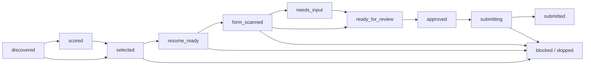

# Job Search And Application Automation

ApplyTeX ATS separates job discovery, resume preparation, form filling, and
submission. The browser is an executor, not the source of truth.

## Current Phase

Implemented:

- typed Greenhouse, Lever, and Ashby public-board adapters;
- deterministic filtering, ranking, normalization, and deduplication;
- partial-source failure reporting;
- SQLite persistence for searches, jobs, and applications;
- persistent role, geography, and internship authorization preferences;
- a Manifest V3 Chrome extension for LinkedIn, Greenhouse, and Lever;
- deterministic form-answer planning that leaves unknown answers unresolved;
- optional local-only EEO answers that require explicit autofill consent;
- reviewed form filling with no final-submit capability;
- a validated application state machine;
- an explicit approval requirement before submission can begin.

Not implemented:

- resume upload to an application form;
- account creation or login automation;
- final submission.

## State Machine

There is intentionally no transition from `ready_for_review` directly to
`submitting`.

## Planned Phases

1. Resume optimization and upload integration.
2. Better site-specific field and multi-step form adapters.
3. User-editable fill-plan review.
4. Pause/resume, retries, and failure recovery.

## Safety Rules

- Never bypass CAPTCHA, MFA, identity checks, or site access controls.
- Never infer demographic, disability, veteran, authorization, sponsorship, or
  salary answers. Voluntary EEO answers require explicit stored values and
  explicit autofill consent.
- Never create accounts or passwords without explicit user action.
- Never submit without approval for the exact job and answer set.
- Store no browser passwords in the project database.
- Keep provider credentials out of source control.

## Future Browser Shape

The MVP uses a Chrome extension connected to the local FastAPI service. The
extension captures jobs, scans the user-opened page, and fills reviewed known
fields after a separate click. The backend owns job matching, resume
optimization, answer resolution, and persistence. Final submission remains a
manual browser action. Playwright remains the automated test harness.
